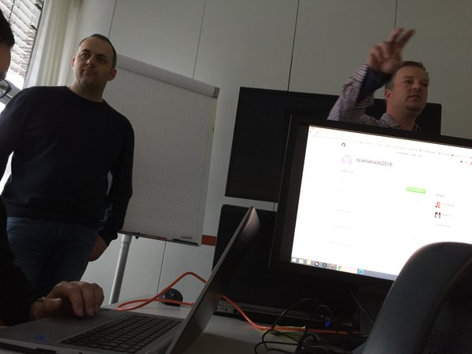

# Workshop: Micro Services with NodeJS and Docker

Spartakiade 2016

## Quicklinks

[Consul UI](http://46.101.251.23:8500/ui/)
[Discovery Explorer](http://discovery-explorer.63ae326f.svc.dockerapp.io)

### How-To ...

* [Setup Consul](how-to-setup-consul.md)
* [Setup Registrator](how-to-setup-registrator.md)
* [Search MusicBrainz](how-to-search-musicbrainz.md)

